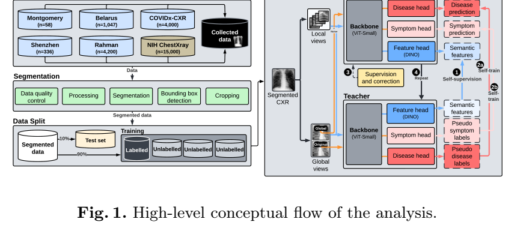
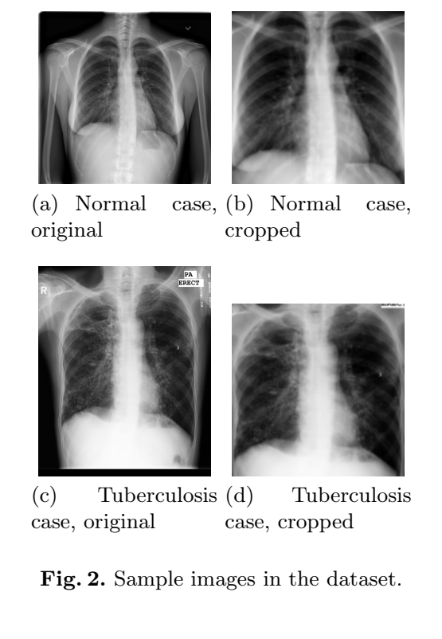
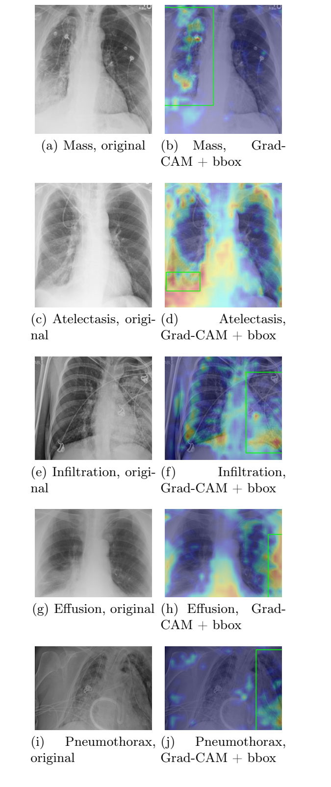

# Tuberculosis and Symptom Detection

Minimal source release for the paper:

**An Explainable Hybrid AI Framework for Enhanced Tuberculosis and Symptom Detection**

- [Paper PDF](paper/2510.18819.pdf)
- [arXiv page](https://arxiv.org/abs/2510.18819)
- [arXiv PDF](https://arxiv.org/pdf/2510.18819)

## Core Code

- `vision_transformer.py` - ViT backbone and DINO / disease / symptom heads
- `utils.py` - DINO training utilities and model wrapper
- `CXR_dataset.py` - chest X-ray dataset loader
- `pretrain.py` - supervised bootstrap training
- `main_run.py` - teacher-student self-training loop

Datasets, checkpoints, logs, baseline experiments, generated outputs, and non-paper images are not included.

## Paper Figures

The images below are extracted from the paper PDF.

